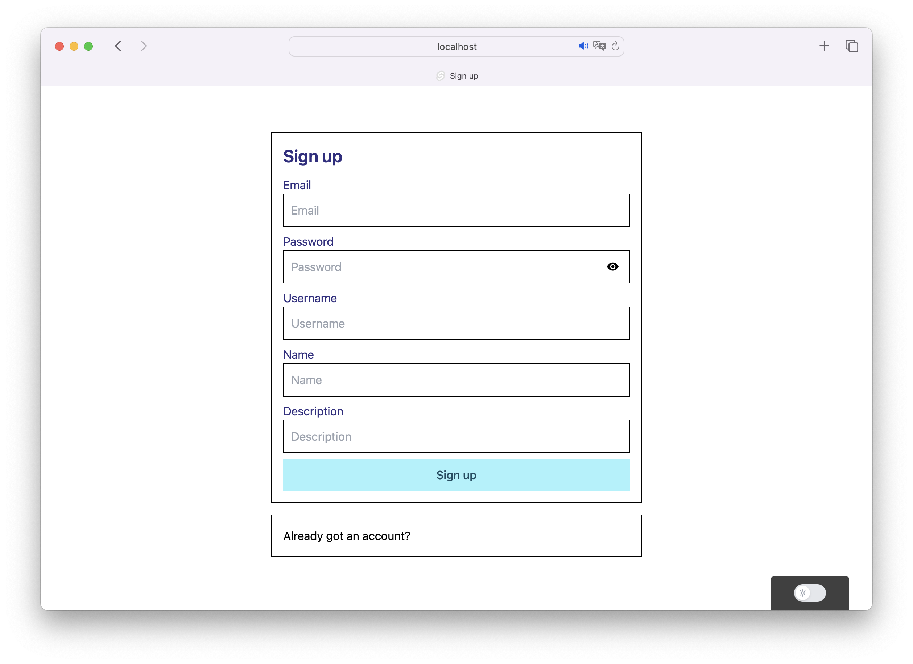
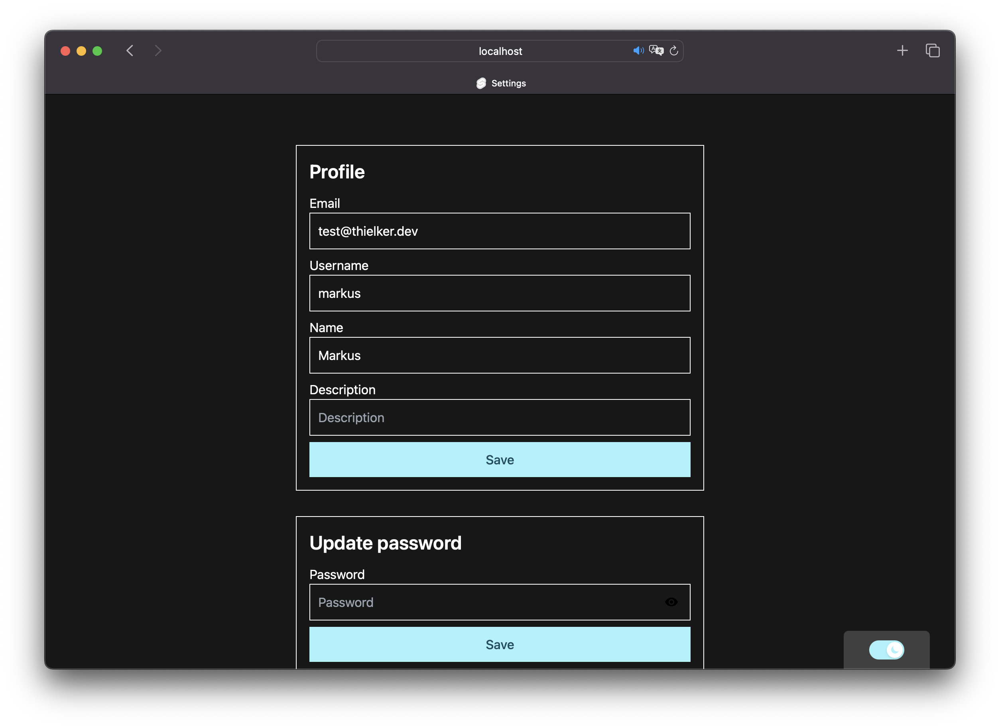

# ☄️ Ory Template

> [!Warning]  
> This project is work in progress. There is no guarantee that everything will work as it should and breaking changes in the future are possible.

The goal of this project is to create an easy-to-use setup to self-host [Ory Kratos](https://www.ory.sh/kratos) and [Ory Hydra](https://www.ory.sh/hydra).
It will contain an authentication UI, implementing all self-service flows for Ory Kratos and Ory Hydra, as well as an admin UI.
All UI components are written in Svelte and Typescript, and styled using TailwindCSS.

## Getting started

Start the backend services using Docker Compose:

```bash
cp /docker/ory-dev/.env.example /docker/ory-dev/.env
docker compose -f docker/ory-dev/docker-compose.yaml up -d
sh docker/ory-dev/hydra-setup.sh # creates an OAuth2 client (test the consent flow on http://localhost:5555)
```

Then start the authentication UI using npm:

```bash
cd authentication
cp .env.example .env
npm install
npm run dev
```

## Deployment

Deploying the authentication Node on your server is relativly easy. Everything is prepared and the required steps to take are as few as possible. Just follow the steps below.

1. Clone this repository to your development machine.
2. Replace all occurences of "accounts.thielker.xyz" with your domain.
3. Copy the .env.example file in /docker/ory-test/ to .env. Make sure the domains were changed in step 2.
4. Configure the CORS rules in /docker/ory-test/ory/kratos/kratos.yaml and /docker/ory-test/ory/hydra/hydra.yaml.
5. Configure the cookies in in /docker/ory-test/ory/kratos/kratos.yaml and /docker/ory-test/ory/hydra/hydra.yaml.

Thats everything you need to change in the configurations. Make sure that all changes are only inside docker/ory-test/.
To actually deploy the project, you need to have Docker and Docker Compose installed on your server.

1. Open the /authentication/deploy.sh script and change the variables at the top to your needs.
2. Execute the script on your local development machine.

The script will build the docker image for the authentication UI, export it as a tar file, copy it with all required configurations and the docker-compose.yaml to your server and import it there. Then it will start the docker containers on your server.

## Authentication UI

The authentication UI is already implemented and working. It supports all self-service flows for Ory Kratos and Ory Hydra. It is implemented in a way, that customizing style and page layout is very easy. 





### Next steps

The foundation is laid out, but there is still a lot of work to do. The next steps are:
- Add a deployment setup
- Add a sample using the OAuth2 client for authentication
- Improve styling and make layout responsive
- Add support for more languages

## Admin UI

soon.
